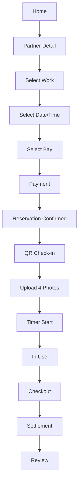

# User Flow (MVP)

## Primary Flow

```mermaid
flowchart TD
A[Home] --> B[Partner Detail]
B --> C[Select Work]
C --> D[Select Date/Time]
D --> E[Select Bay]
E --> F[Payment]
F --> G[Reservation Confirmed]
G --> H[QR Check-in]
H --> I[Upload 4 Photos]
I --> J[Timer Start]
J --> K[In Use]
K --> L[Checkout]
L --> M[Settlement]
M --> N[Review]
```
