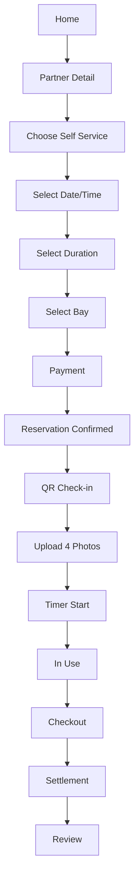
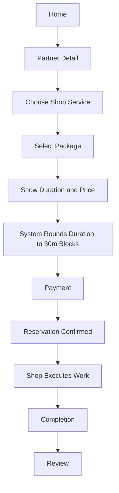

# User Flow (MVP)

## Self Service Flow

```mermaid
flowchart TD
A[Home] --> B[Partner Detail]
B --> C[Choose Self Service]
C --> D[Select Date/Time]
D --> E[Select Duration]
E --> F[Select Bay]
F --> G[Payment]
G --> H[Reservation Confirmed]
H --> I[QR Check-in]
I --> J[Upload 4 Photos]
J --> K[Timer Start]
K --> L[In Use]
L --> M[Checkout]
M --> N[Settlement]
N --> O[Review]
```

## Shop Service Flow

```mermaid
flowchart TD
A[Home] --> B[Partner Detail]
B --> C[Choose Shop Service]
C --> D[Select Package]
D --> E[Show Duration and Price]
E --> F[System Rounds Duration to 30m Blocks]
F --> G[Payment]
G --> H[Reservation Confirmed]
H --> I[Shop Executes Work]
I --> J[Completion]
J --> K[Review]
```
