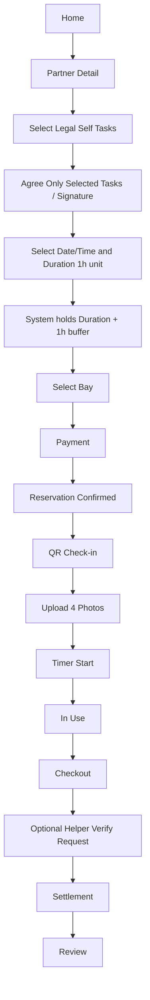
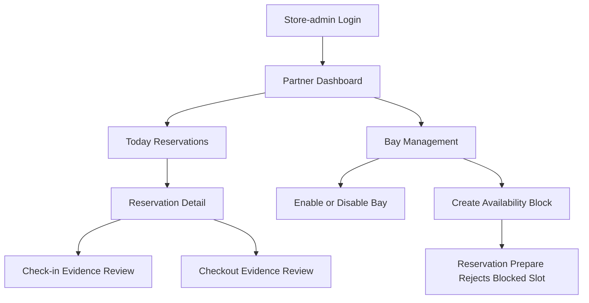

# User Flow (MVP)

## Self Service Flow

## Notes

- Package flow is unchanged in MVP.
- Self-maintenance flow requires legal task allowlist selection.
- User must explicitly agree to perform only selected tasks.
- Work time is booked in 1-hour units.
- Bay conflict blocking window = start_time ~ (end_time + 1 hour buffer).
- Helper verification is optional at checkout.
- Helper verification fee = 5,000 base + (selected_task_count × per-task fee).

## Store Admin Flow

## Store Admin Notes

- Store-admin 화면은 `/partner-admin` 아래에 둔다.
- Store-admin은 `partner_admins`에 연결된 본인 정비소 데이터만 볼 수 있다.
- 오늘 예약/예정 예약은 `reservations.partner_id` 기준으로 조회한다.
- 체크인/체크아웃 사진과 체크리스트는 본인 정비소 예약에 한해 조회한다.
- 베이 활성/비활성은 `bays.partner_id`가 본인 정비소인 경우에만 허용한다.
- 임시 휴무, 장비 점검, 특정 베이 고장 등은 `partner_availability_blocks`에 저장한다.
- 사용자 예약 준비 단계는 `partner_availability_blocks`와 겹치는 시간대를 거부해야 한다.
