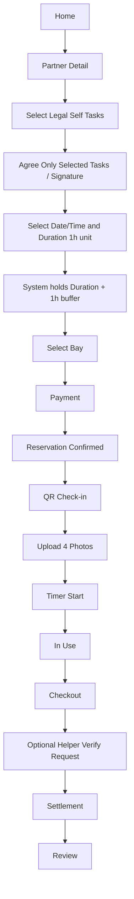

# User Flow (MVP)

## Self Service Flow

## Notes

- Package flow is unchanged in MVP.
- Self-maintenance flow requires legal task allowlist selection.
- User must explicitly agree to perform only selected tasks.
- Work time is booked in 1-hour units.
- Bay conflict blocking window = start_time ~ (end_time + 1 hour buffer).
- Helper verification is optional at checkout.
- Helper verification fee = 5,000 base + (selected_task_count × per-task fee).
