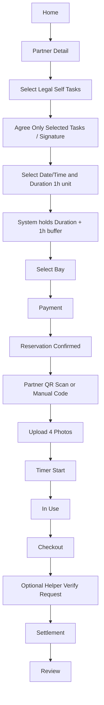
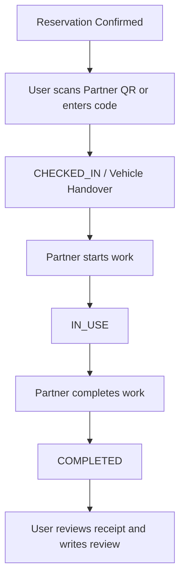
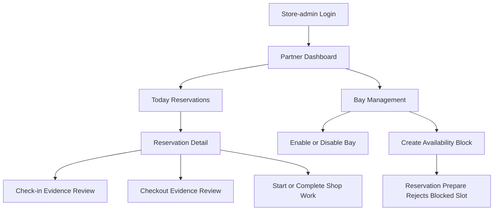

# User Flow (MVP)

## Self Service Flow

```mermaid
flowchart TD
A[Home] --> B[Partner Detail]
B --> C[Select Legal Self Tasks]
C --> D[Agree Only Selected Tasks / Signature]
D --> E[Select Date/Time and Duration 1h unit]
E --> F[System holds Duration + 1h buffer]
F --> G[Select Bay]
G --> H[Payment]
H --> I[Reservation Confirmed]
I --> J[Partner QR Scan or Manual Code]
J --> K[Upload 4 Photos]
K --> L[Timer Start]
L --> M[In Use]
M --> N[Checkout]
N --> O[Optional Helper Verify Request]
O --> P[Settlement]
P --> Q[Review]
```

## Shop Service Flow

```mermaid
flowchart TD
A[Reservation Confirmed] --> B[User scans Partner QR or enters code]
B --> C[CHECKED_IN / Vehicle Handover]
C --> D[Partner starts work]
D --> E[IN_USE]
E --> F[Partner completes work]
F --> G[COMPLETED]
G --> H[User reviews receipt and writes review]
```

## Notes

- Package flow is unchanged in MVP.
- Self-maintenance flow requires legal task allowlist selection.
- User must explicitly agree to perform only selected tasks.
- Work time is booked in 1-hour units.
- Bay conflict blocking window = start_time ~ (end_time + 1 hour buffer).
- Helper verification is optional at checkout.
- Helper verification fee = 5,000 base + (selected_task_count × per-task fee).
- Self/Shop 모두 사용자가 정비소 고정 QR 또는 수동 코드로 도착을 인증한다.
- Self는 도착 인증 후 체크인 사진 4장을 제출하고 사용자 흐름에서 이용을 시작한다.
- Shop은 도착 인증 즉시 `CHECKED_IN`이 되며 작업 시작과 완료는 Partner-admin이 처리한다.
- 예약 종료 시각까지 체크인되지 않은 `CONFIRMED` 예약은 서버에서
  `NO_SHOW`로 전환되어 지난 이용에 표시된다.
- 노쇼는 취소나 환불 완료 상태가 아니며 결제 기록은 그대로 유지한다.

## Store Admin Flow

```mermaid
flowchart TD
A[Store-admin Login] --> B[Partner Dashboard]
B --> C[Today Reservations]
C --> D[Reservation Detail]
D --> E[Check-in Evidence Review]
D --> F[Checkout Evidence Review]
D --> K[Start or Complete Shop Work]
B --> G[Bay Management]
G --> H[Enable or Disable Bay]
G --> I[Create Availability Block]
I --> J[Reservation Prepare Rejects Blocked Slot]
```

## Store Admin Notes

- Store-admin 화면은 `/partner-admin` 아래에 둔다.
- Store-admin은 `partner_admins`에 연결된 본인 정비소 데이터만 볼 수 있다.
- 오늘 예약/예정 예약은 `reservations.partner_id` 기준으로 조회한다.
- 체크인/체크아웃 사진과 체크리스트는 본인 정비소 예약에 한해 조회한다.
- Partner-admin은 정비소 고정 QR과 수동 체크인 코드를 발급·재발급한다.
- Shop 예약은 `CHECKED_IN → IN_USE → COMPLETED` 전환을 Partner-admin만 수행한다.
- 종료된 미체크인 예약은 목록 조회 시 `CONFIRMED → NO_SHOW`로 전환되며,
  Partner가 남긴 노쇼 메모는 운영 증적으로 함께 보관한다.
- 베이 활성/비활성은 `bays.partner_id`가 본인 정비소인 경우에만 허용한다.
- 임시 휴무, 장비 점검, 특정 베이 고장 등은 `partner_availability_blocks`에 저장한다.
- 사용자 예약 준비 단계는 `partner_availability_blocks`와 겹치는 시간대를 거부해야 한다.
